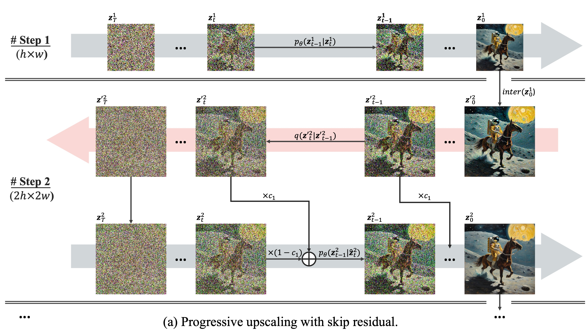

# ComfyUI Iterative Mixing Nodes

This repo contains 2 nodes for [ComfyUI](https://github.com/comfyanonymous/ComfyUI) that combine to implement a strategy I'm calling Iterative Mixing of Latents.
The technique is stolen from the [DemoFusion](https://arxiv.org/abs/2311.16973) paper with gratitude. I also acknowledge [BlenderNeko](https://github.com/BlenderNeko) for the inspiration that led to the Batch Unsampler node included in this pack.

## Nodes

### Iterative Mixing KSampler:
This node de-noises a latent image while mixing a bit of a noised sequence of latents at each step.
- **model**: a diffusion model
- **positive**: positive conditioning
- **negative**: negative conditioning
- **latent_image_batch**: the batch from the Batch Unsampler
- **seed**: noise generation seed
- **steps**: the number of steps of de-noising to perform
- **cfg**: classifier-free-guidance scale for de-noising
- **sampler_name**: the name of the sampler you wish to use
- **scheduler**: the name of the scheduler to use
- **denoise**: the denoising strength - note I'm not sure if this does anything
- **alpha_1**: a parameter to specify how latents are mixed; try values between 0.1 and 2.0
- **reverse_input_batch**: should always be True because the Batch Unsampler produces latents in the wrong order
- **blending_schedule**: choose between cosine and linear to get a different effect; alpha_1 is ignored with linear

### Batch Unsampler:
This node takes a latent image as input, adding noise to it in the manner described in the original [Latent Diffusion Paper](https://arxiv.org/abs/2112.10752).
- **model**: a diffusion model
- **latent_image**: the latent that you want to unsample into a series of progressively noisier latents
- **sampler_name**: the sampler that will give us the correct sigmas for the model
- **scheduler**: the scheduler that will give us the correct sigmas for the model
- **steps**: the number of steps of noising; the latent will be noised all the way across this many steps
- **start_at_step**: if you want to start part way (untested)
- ***end_at_step**: if you want to end part way (untested)

### Iterative Mixing KSampler Advanced:
This node de-noises a latent image while mixing a bit of the noised latents in from the Batch Unsampler at each step. Note that the number of steps is inferred from the size of the input latent batch from the Batch Unsampler, which is why this parameter is missing.
- **model**: a diffusion model
- **positive**: positive conditioning
- **negative**: negative conditioning
- **latent_image_batch**: the batch from the Batch Unsampler
- **seed**: noise generation seed
- **cfg**: classifier-free-guidance scale for de-noising
- **sampler_name**: the name of the sampler you wish to use
- **scheduler**: the name of the scheduler to use
- **denoise**: the denoising strength - note I'm not sure if this does anything
- **alpha_1**: a parameter to specify how latents are mixed; try values between 0.1 and 2.0
- **reverse_input_batch**: should always be True because the Batch Unsampler produces latents in the wrong order
- **blending_schedule**: choose between cosine and linear to get a different effect; alpha_1 is ignored with linear

## What does "Iterative Mixing" mean?

I made up the term "Iterative Mixing." Sorry. In the [DemoFusion](https://arxiv.org/abs/2311.16973) paper, they use the term "skip residual" (see section 3.3), but I just don't like that term (**emphasis** below is mine):

> For each generation phase $`s`$, we have already obtained a series of noise-inversed versions of $`z_0^{'s}`$ as $`z_t^{'s}`$ with $`t`$ in $`[1, T]`$. During the denoising process, we introduce the corresponding noise-inversed versions as **skip residuals**. In other words, we modify $`p_{\theta}(z_{t-1}|z_t)`$ to $`p_{\theta}(z_{t-1}|\hat{z_t})`$ with

> $$
\hat{z_t}^{s} = c_1 \times z_t^{'s} + (1 - c_1) \times z_t^{s},
$$

> where $`c_1 = \left(\frac{1 + \cos(\frac{\pi t}{T})}{2}\right)^{\alpha_1}`$ is a scaled cosine decay factor with a scaling factor $`\alpha_1`$. This essentially utilizes the results from the previous phase to guide the generated image's global structure during the initial steps of the denoising process. Meanwhile, we gradually reduce the impact of the noise residual, allowing the local denoising paths to optimize the finer details more effectively in the later steps.

**Note**: I correct the author by removing the 2 from the $`2{\pi}`$ that was originally in the numerator of the cosine expression in the paper's equation 4. The author acknowledged the mistake and will correct it in a future revision.

## How are you supposed to use this node?

Latent Diffusion Models (LDMs) are trained on images having a particular resolution. The original Stable Diffusion was trained on images with a maximum resolution of 512x512px and having 3 channels (RGB). When converted into the latent space by a Variational Auto Encoder (VAE), the resolution of the "latent" is 64x64 and the images have 4 channels which have no meaningful analog in color space.

If you try to use a model that was trained on 512x512px images to generate an image larger than 512x512, the model will happily generate pixels for you, but the image will not have internal consistency. For example, you may find the model generating extra people or extra limbs. The perceptive field of the model, in other words, is only 512x512.

The idea behind this node is to help the model along by giving it some scaffolding from the lower resolution image while denoising takes place in a sampler (i.e. a KSampler in ComfyUI parlance). We start by generating an image at a resolution supported by the model - for example, 512x512, or 64x64 in the latent space. We then upscale the latent image by 2x giving us a 1024x1024 latent. And then, within the **Batch Unsampler**, we add noise to the 2x latent progressively according to the noise schedule that was used in training the original stable diffusion model to obtain a sequence of progressively noisier latents.

These progressively noisier latents are then passed to the **Iterative Mixing KSampler**, which performs the usual latent diffusion sampling. However, rather than starting our next phase of sampling using the 2x latent, we instead start with the noisiest latent from the Batched Unsampler output. Then, each timestep, we mix in a portion of the next-least-noisiest latent from that batch. The portion that we mix in declines over time until in the final step, we are mixing in almost none of it. The image below illustrates the process outlined in the DemoFusion paper:

By mixing in a portion of the noised 2x latent, we are helping the LDM model to generate a new image that is more consistent with the structure of the original image, but since the de-noising is indeed happening at the new resolution, the details should be filled in at full strength.

The authors of the DemoFusion paper say that the output of the skip-residual process is grainy. I agree. But we can easily fix this in ComfyUI by bolting a KSampler onto the output with a low denoising level to clean things up. In the DemoFusion paper, they invent an elaborate sliding window algorithm that they call "dilated sampling" to incorporate local and global context during de-noising. However, testing of their algorithm suggests that we may be better off just doing a bit more sampling at a light de-noising level and introducing other concepts like ControlNet to constrain the generate of extra limbs and whatnot. **Your mileage may vary**.