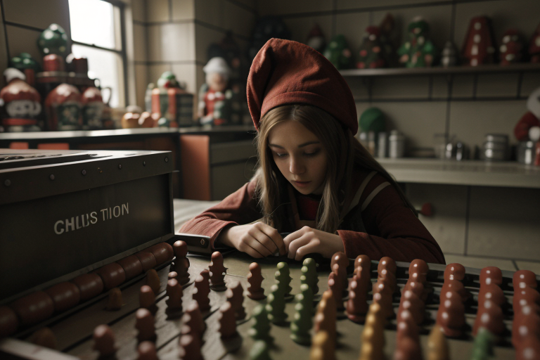
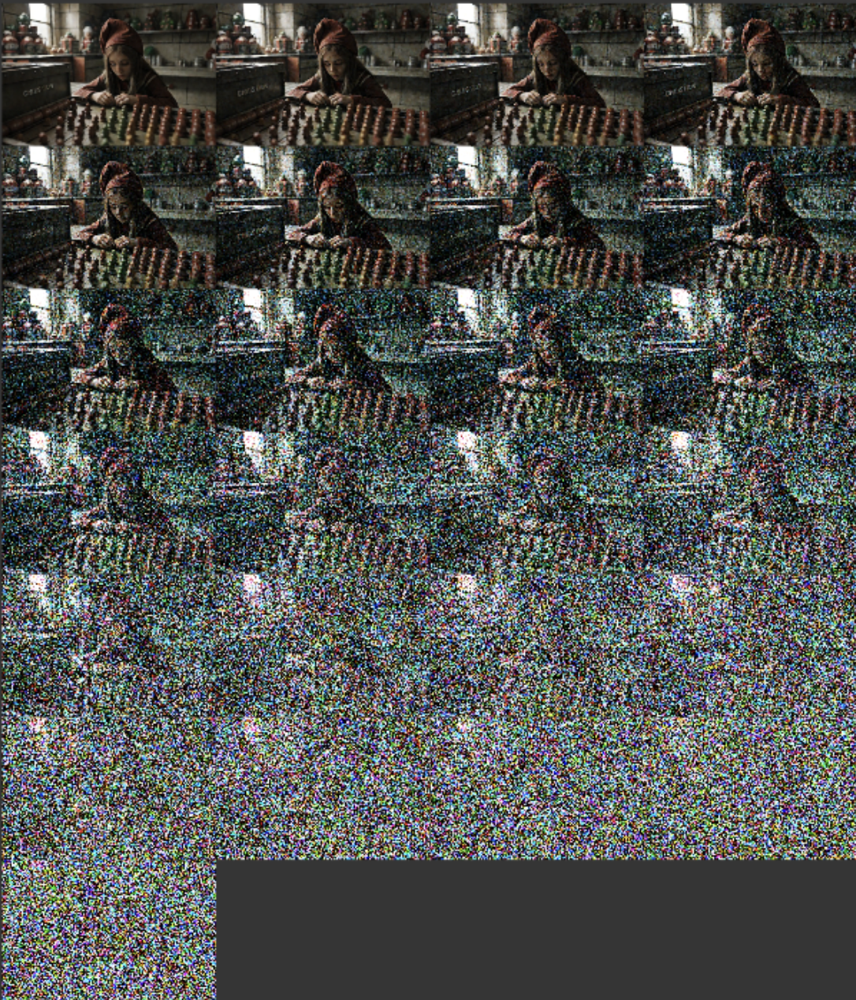
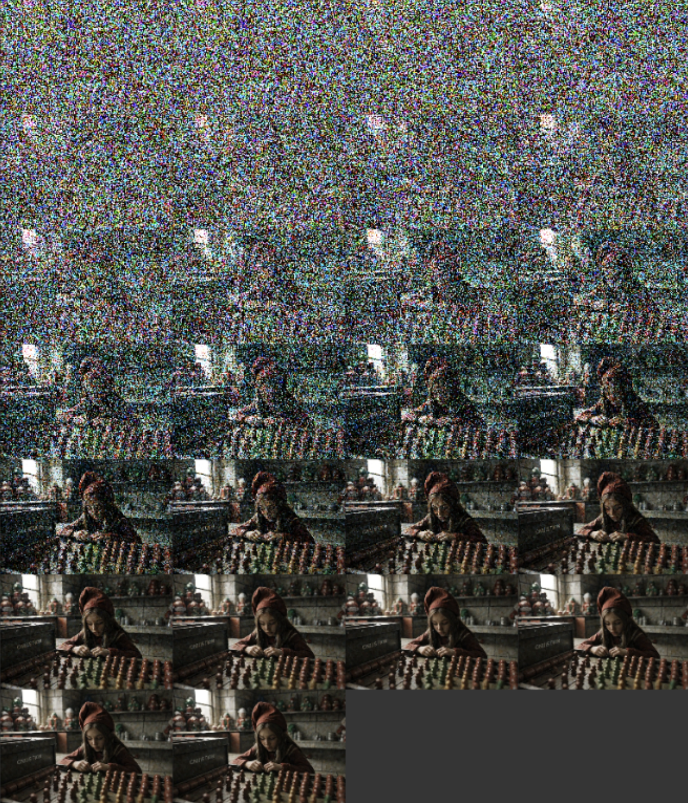
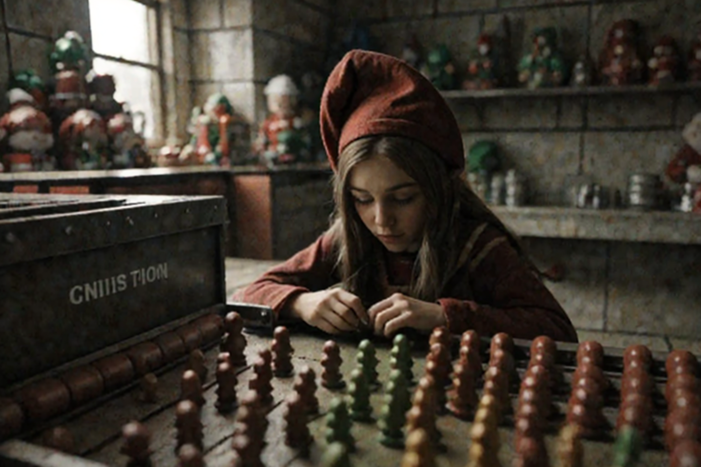
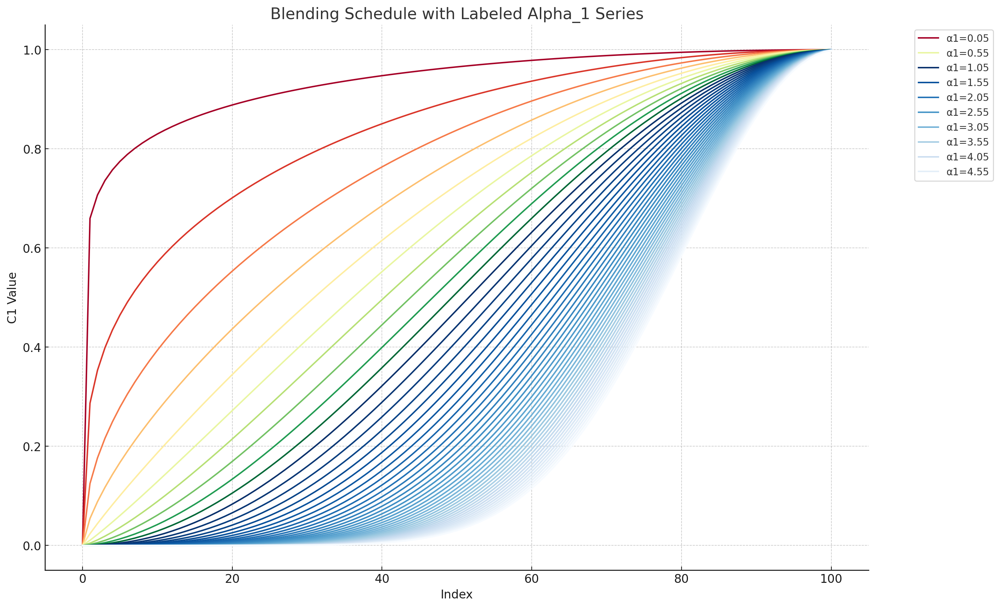
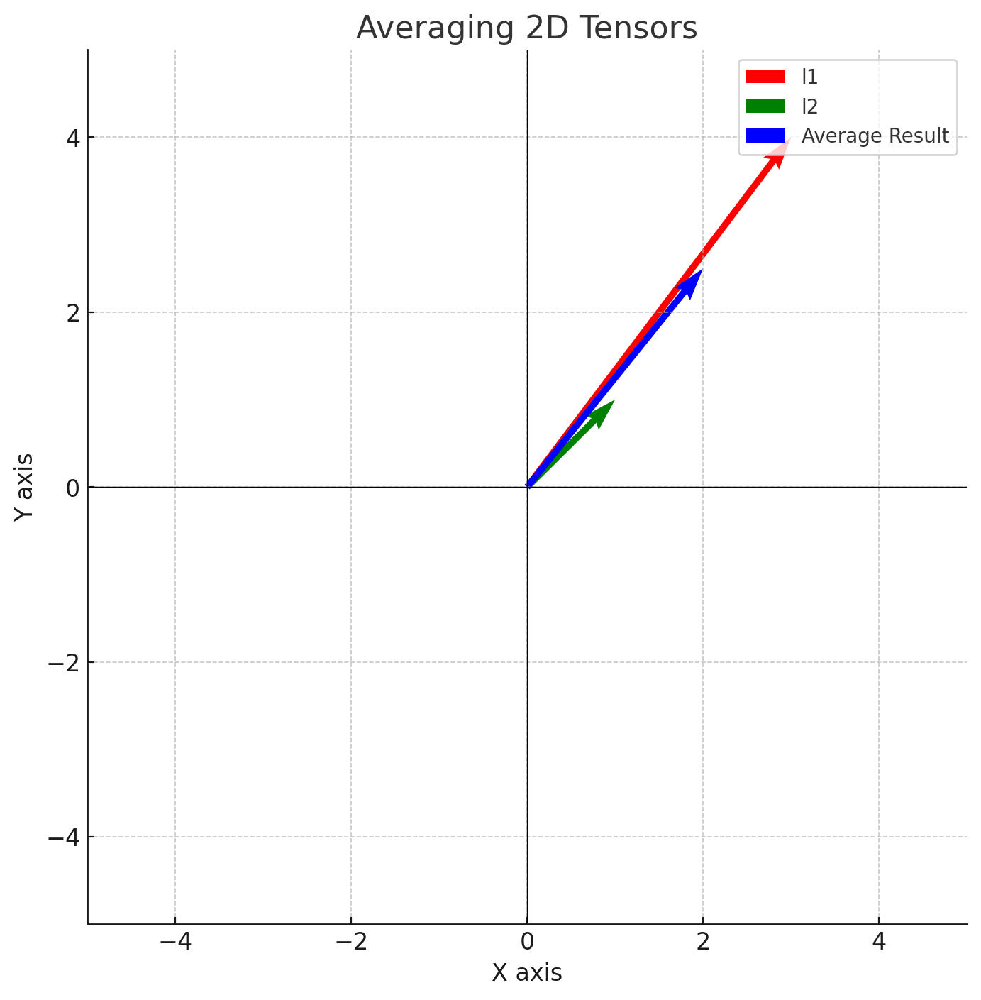
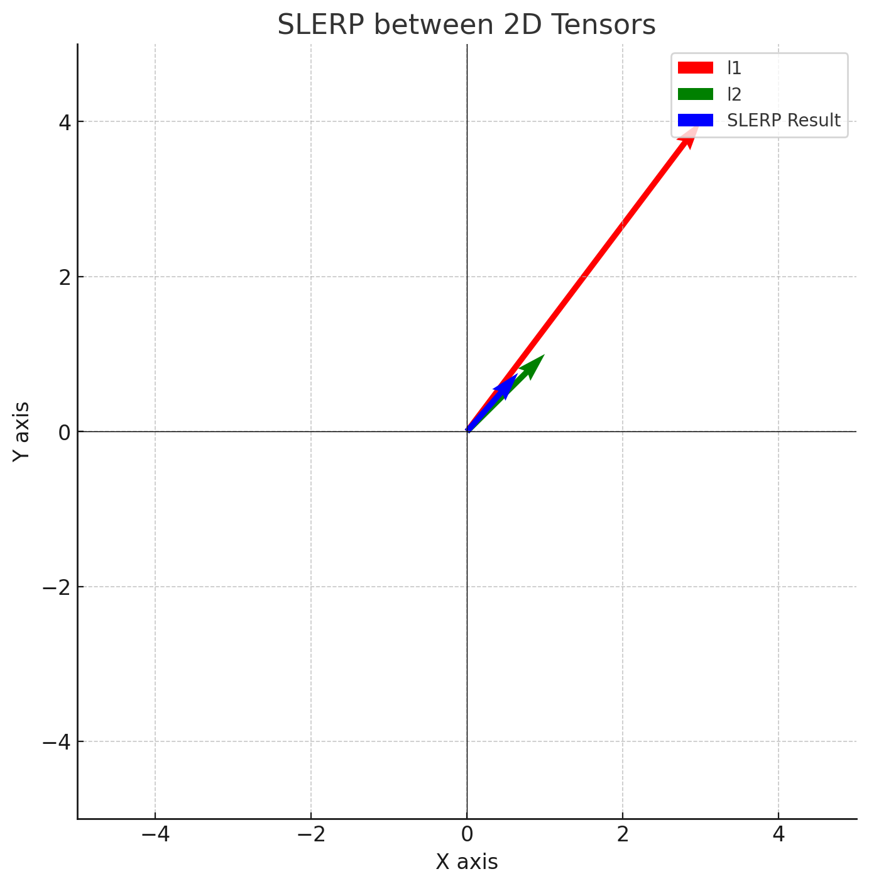
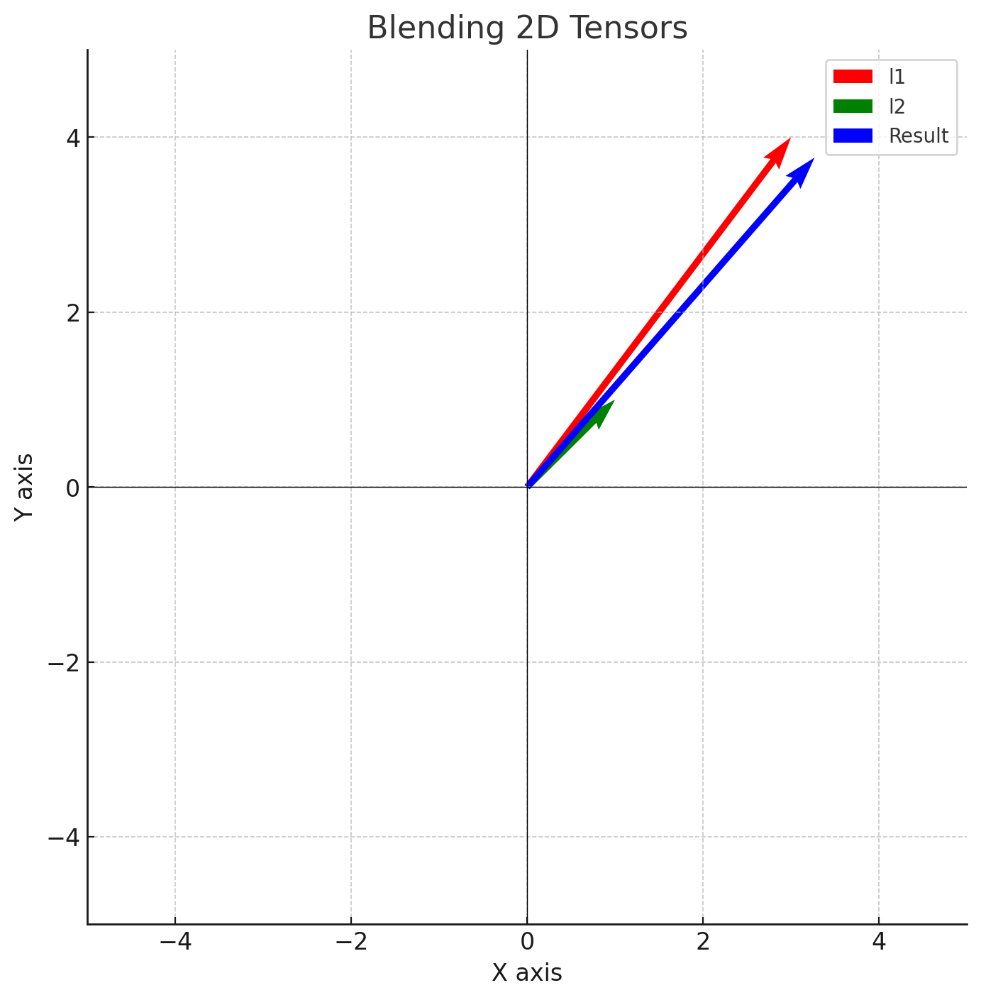

# ComfyUI Iterative Mixing Nodes

This repo contains nodes for [ComfyUI](https://github.com/comfyanonymous/ComfyUI) that combine to implement a strategy I'm calling Iterative Mixing of Latents.
The technique is somewhat borrowed from the [DemoFusion](https://arxiv.org/abs/2311.16973) paper, with gratitude. I also acknowledge [BlenderNeko](https://github.com/BlenderNeko) for the inspiration that led to the Batch Unsampler node included in this pack.

## Note: This pack contains some deprecated nodes

In my first attempt at iterative mixing, I developed a few KSampler-type nodes that call the underlying `sample()` function inside ComfyUI to denoise and then mix noised latents step by step. This method produces grainy output for reasons I don't yet fully understand. On the advice of @comfyanonymous, I have now moved onto a new approach that uses the `SamplerCustom` node.

## Updates

## February 9th, 2024

- Added `rewind` option to the `IterativeMixingSampler` node. This highly experimental option causes the sampler to "rewind" sampling back to 50% of the steps, blending in a new set of noised latents as it samples forward again to the end. It then rewinds again half as far again (i.e. to 75% of the step count) and so on until the rewind step count exceeds 80% of the total steps (an arbitrary figure for which there is no configuration option). The idea behind rewind is to see whether it may give the model a chance to produce a better targeted output.
- Deprecated the `normalize_on_mean` option in the `IterativeMixingSampler`; this option now does nothing but issue a warning to the console. If you want some normalization of your latents or images, please try my new node pack: https://github.com/ttulttul/ComfyUI-Tensor-Operations

## January 12th, 2024

- The iterative mixing sampler code has been extensively reworked.
- Masked latents are now handled correctly; however, iterative mixing is not a good fit for using the `VAEEncodeForInpaint` node because it erases the masked part, leaving nothing for the iterative mixer to blend with.
- The `euler_perlin` sampling mode has been fixed up. Some things that were apparently working before were not actually implemented correctly. This is still an area of active investigation; consider any functionality in this mode to be highly experimental and subject to change.

## January 4th, 2024

- Added new nodes that implement iterative mixing in combination with the `SamplerCustom` node from ComfyUI, which produces very clean output (no graininess). See the documentation below for details along with a new example workflow. This new approach includes the addition of a noise masking strategy that may improve results further.
- Reorganized the code into separate source files to keep things tidy.
- Archived old workflow examples that may not work properly after the reorganization.

### December 30th, 2023

- Fixed a bug where the `blending_function` parameter was not implemented properly in the `Iterative Mixing KSampler Advanced` node, causing an error. Sorry.

### December 29th, 2023

- Added `blending_function`, which lets you change the way that latents are blended. Try blending using slerp instead of basic addition. I have found slerp creates fewer artifacts because it works better in high-dimensional spaces.
- Reworked the node parameters a bit. This commit breaks your workflows -- sorry.

## Nodes

### IterativeMixingSampler:

*Important*: Do not enable `add_noise` in the `SamplerCustom` node. The iterative mixing sampler does not need noise to be injected by the `SamplerCustom` node and will generate garbage if this option is set to `true`.

This node feeds into a `SamplerCustom` node to implement iterative mixing sampling, with various options to control the process.
- **model**: a diffusion model
- **mixing_masks**: *this optional parameter is currenty unused*; in future, you will be able to feed in a batch of masks that will be mixed in at each stage of denoising
- **sampler**: select a sampling method such as `euler`
- **alpha_1**: a parameter that controls the `blending_schedule` curve's steepness
- **blending_schedule**: select between `cosine`, `logistic`, and `linear` blending curves for different results
- **blending_function**: select between `addition`, `slerp`, and `norm_only` (see below for illustrations) to vary how the latents are blended during sampling
- **normalize_on_mean**: deprecated; this option does nothing
- **start_blending_at_pct**: set the fraction of `steps` at which the blending curve will begin to start mixing in diffused latents; prior to this fraction of `steps`, only the noised `z_prime` latents will be sent to the model for denoising
- **stop_blending_at_pct**: set the fraction of `steps` at which the blending curve will stop mixing in noised latents; after this point, the model will only be given denoised latents
- **clamp_blending_at_pct**: without altering the blending curve, clamp the curve to 1.0 to halt blending of noised latents after this fraction of `steps`; this setting can be more effective than `stop_blending_at_pct` but has a similar effect
- **blend_min**: squeeze the minimum value of the blending curve to this value; this has the effect of putting a minimum on the fraction of the denoised latent that is blended with the noised latent sequence
- **blend_max**: squeeze the maximum value of the blending curve to this value; this has the effect of putting a maximum on the fraction of the denoised latent that is blended with the noised latent sequence, ensuring that some amount of the noise latent is always blended in
- **perlin_mode**: used with the `euler_perlin` sampler option above, this selects between different perlin noise blending modes; if I have time, I'll write some documentation to describe precisely what these modes do
- **perlin_strength**: a metric that controls the amount of perlin noise operations that take place during sampling
- **perlin_scale**: this controls the blobby-ness of the perlin noise; values near 1.0 are close to pure noise where as values close to 100.0 result in huge blobs taking up nearly the entire area
- **rewind**: (very **experimental**) this causes the sampler to renoise and rewind to 50% of the steps and run forward again, then go back to 75%, etc.. to re-target the model

### IterativeMixingScheduler:

Use this node in combination with the `IterativeMixingSampler` described above. This node generates a set of sigmas to feed into the mixing sampler. It requires a model input to fetch the sigmas-related parameters from the model. The options on this node should be self-explanatory.

### IterativeMixingSchedulerAdvanced:

This is the same as the `IterativeMixingScheduler` but adds a start and end step so that you can control
the steps for denoising. Try setting the end step to 50% of the total step count, which will cause the iterative
mixing sampler to generate grainy output containing rich noise that can be passed into another iterative mixing
sampler for refinement.

Note that you must adjust the `start_blending_at` and `stop_blending_at` parameters on the sampler node
to match the same proportion of total step count specified in the `IterativeMixingSchedulerAdvanced`, otherwise
the blending schedule will configure itself to match the total steps in the range you specify in this node, rather than
fitting the curve to the `steps` parameter. For instance, if you set `steps` to `40` and `start_at_step` to `0` and `end_at_step` to `20` (i.e. 50% of the way through the total steps), then you must adjust `stop_blending_at` to `80`
so that the blending schedule will be stretched horizontally by a factor of two to account for the smaller length of
the `sigmas` tensor being passed by the `IterativeMixingSchedulerAdvanced`. I know this is confusing and if a better way
emerges, I will support it.

## MixingMaskGeneratorNode:

This node generates a batch of perlin noise masks. In future, you will be able to feed these masks into the `IterativeMixingSampler` to precisely control latent mixing by applying a mask to the process at each step. For now, it offers a way to see for yourself what the perlin masks look like at various scale levels.

## Deprecated Nodes

The nodes described below are deprecated. Use them at your own risk to obtain interesting and potentially buggy results.

### Iterative Mixing KSampler:
This node de-noises a latent image while mixing a bit of a noised sequence of latents at each step.
- **model**: a diffusion model
- **positive**: positive conditioning
- **negative**: negative conditioning
- **latent_image_batch**: the batch from the Batch Unsampler
- **seed**: noise generation seed
- **steps**: the number of steps of de-noising to perform
- **cfg**: classifier-free-guidance scale for de-noising
- **sampler_name**: the name of the sampler you wish to use
- **scheduler**: the name of the scheduler to use
- **denoise**: the denoising strength - note I'm not sure if this does anything
- **alpha_1**: a parameter to specify how latents are mixed; try values between 0.1 and 5.0
- **blending_schedule**: choose between cosine, linear, and logistic to get a different effect; alpha_1 is ignored with linear
- **blending_function**: choose a blending function; slerp and norm_only seem to perform better than addition
- **normalize_on_mean**: normalize the mixed latent by the mean of the of the input latent; this can help to correct washed out images

### Batch Unsampler:
This node takes a latent image as input, adding noise to it in the manner described in the original [Latent Diffusion Paper](https://arxiv.org/abs/2112.10752).
- **model**: a diffusion model
- **sampler_name**: the sampler that will give us the correct sigmas for the model
- **scheduler**: the scheduler that will give us the correct sigmas for the model
- **steps**: the number of steps of noising; the latent will be noised all the way across this many steps
- **start_at_step**: if you want to start part way (untested)
- ***end_at_step**: if you want to end part way (untested)
- **latent_image**: the latent that you want to unsample into a series of progressively noisier latents
- **normalize_fraction**: normalize the entire unsampled batch based on the mean of this share of the last latents in the batch

**Note**: The `normalize_fraction` amount is highly experimental and unscientific. It serves to remove any bias in the final noised latent in the batch so that sampling from that noise will have the maximum possible dynamic range.

### Iterative Mixing KSampler Advanced:
This node de-noises a latent image while mixing a bit of the noised latents in from the Batch Unsampler at each step. Note that the number of steps is inferred from the size of the input latent batch from the Batch Unsampler, which is why this parameter is missing.
- **model**: a diffusion model
- **positive**: positive conditioning
- **negative**: negative conditioning
- **latent_image_batch**: the batch from the Batch Unsampler
- **seed**: noise generation seed
- **cfg**: classifier-free-guidance scale for de-noising
- **sampler_name**: the name of the sampler you wish to use
- **scheduler**: the name of the scheduler to use
- **denoise**: the denoising strength - note I'm not sure if this does anything
- **alpha_1**: a parameter to specify how latents are mixed; try values between 0.1 and 2.0
- **reverse_input_batch**: should always be **True** because the **Batch Unsampler** produces latents in the reverse order
- **blending_schedule**: choose between cosine, linear, and logistic to get a different effect; alpha_1 is ignored with linear
- **stop_blending_at_pct**: squeeze the blending schedule so that it ends at a given fraction of the total steps; values above 1.0 are also just fine to stretch the schedule past the end of the steps for interesting results
- **clamp_blending_at_pct**: clamp the blending schedule to 1.0 at and above this fraction of total steps
- **blending_function**: choose a blending function; slerp and norm_only seem to perform better than addition

## How the hell does this work?

Whenever we upscale an image, we are taking a relatively small amount of information and making it cover a larger spatial area. Given a 64x64 latent image (this is the size of latent that Stable Diffusion 1.5 VAEs generate), upscaling to 128x128 implies that each of the original latent pixels has to do 4x the work.

Here is a walk-through of how upscaling happens using this node pack.

Example: We start with a 768x512px image generated from an SD1.5 model. Since this image was generated at a resolution that is close to the resolution of images the model was trained on (SD1.5 was trained at 512x512), the model can generate a coherent scene that properly attends to all the pixels no matter how far apart they are, ensuring we don't get extra limbs and weirdness:

Then, we upscale it by 2x using the wonderfully fast [NNLatentUpscale](https://github.com/Ttl/ComfyUi_NNLatentUpscale) model, which uses a small neural network to upscale the latents as they would be upscaled if they had been converted to pixel space and back. This results in a pretty clean but somewhat fuzzy 2x image:

Notice how the upscale is larger, but it's fuzzy and lacking in detail. The fuzziness occurs because upscaling the latents cannot make up for the lost information between the pixels. We need to fix this problem somehow. We could use an upscaling model, which has been trained on thousands of high and low resolution images of all kinds to "fill in the gaps," but that would be so boring...

So instead, we use the Batch Unsampler node from this node pack to generate a sequence of progressively noisier latents. The noise is added to the latents using the same noise schedule as the underlying SD model. This is the noise schedule that was used during training of the model and it does not rely on conditioning, which is why the Batch Unsampler node does not ask for positive or negative conditioning inputs:

We pass the progressively-noised sequence along with the fuzzy 2x-upscaled latent into the Iterative Mixing KSampler Advanced node. The Iterative Mixing KSampler then runs the diffusion sampler step by step, mixing in a bit of the noised sequence latents at each time step. The fraction of the noised latents that is mixed in declines as the steps progress, in accordance with a blending schedule. By default, the blending schedule is a cosine-exponential curve that starts off giving lots of input from the noised sequence, decaying to almost nothing by the end. You can also choose a linear schedule or a logistic curve schedule. Play around with the choise of blending schedule to get different results. There is no hard and fast rule as to which schedule is the best.

After iterative mixing sampling, we get a new 1536x1024px image:

This image is richer detail than the original fuzzy image we passed in (as a latent) before iterative mixing, but it also has some residual noise that shows up as graininess. The graininess results because the stable diffusion model was never trained to operate in this manner and is unable to eliminate all of the noise that was mixed in step by step by the iterative mixing sampler:

Fortunately, getting rid of the noise is really easy. To clean up the noise, we simply pass it through another KSampler at a very low denoising strength. This final "clean up" should be run at the lowest possible denoising strength to avoid removing details and generating artifacts.

## Tips for getting good results

Here are some things to try to get good results. By default, as mentioned above, the iterative mixing sampler will generate grainy output. Cleaning up the grainy output can be accomplished by a second sampler at a low denoise strength of 0.05 - 0.25. General tips:

1. Play with the de-noising strength in the Iterative Mixing KSampler node. Using a de-noising strength of 1.0 will generate the grainiest output, but the output will have a very high level of detail when refined. Using a lower de-noising strength will generate less noise at the output, but won't require as much refinement. Generally speaking, _if you use a low de-noise in the iterative mixer, then you will need a lower de-noise in the refinement sampler_.

2. Try starting with 20 to 40 steps of iterative mixing. You can use fewer steps to get "interesting" output, but it's possible that the amount of noise will be so high as to skew your generation quite far from the coherent output you desire.

3. Scale by no more than 2x at a time. If you are seeking a 4x output, use two phases of upscaling and iterative mixing. I have found that scaling up by more than 2x can result in coherence issues like extra limbs and whatnot.

4. Try using `ControlNet` nodes. Apply a depth or open pose ControlNet based on the initial low resolution image and send that conditioning into the iterative mixing sampler. This will guide the sampling process more carefully along the lines of the structure that you care about. If you are having problems with too many fingers or extra arms, a pose ControlNet will help. The depth ControlNet can help to ensure the structure of a room remains consistent.

5. Try using `IPAdapter` nodes. Similar to ControlNet, IPAdapter allows you to condition the model based on the semantic information in a source image. Feed your 512px image into an IPAdapter and use this to modify your model before inputting into the iterative mixing sampler. You may find this improves the iterative mixing output by better aliging it to the precise composition of the low resolution image.

6. Try using `PatchModelAndDownscale` to adjust your model for the upscale sampling passes. This relatively new node (as of December 2023) implements the Kohya "DeepShrink" concept, downscaling one of the layers of the SD model U-Net for a few steps to increase the "receptive field" of the model, which is appropriate when you are generating images at a resolution that is higher than the resolution the model was trained at. For each upscale level (2x, 4x, etc.), I suggest setting the `downscale_factor` to the same amount. In other words, downscale by 2x for the first pass and 4x for the second pass if you are doing a 4x upscale through two iterative mixing samplers.

## What does "Iterative Mixing" mean?

I made up the term "Iterative Mixing." Sorry. In the [DemoFusion](https://arxiv.org/abs/2311.16973) paper, they use the term "skip residual" (see section 3.3), but I just don't like that term (**emphasis** below is mine):

> For each generation phase $`s`$, we have already obtained a series of noise-inversed versions of $`z_0^{'s}`$ as $`z_t^{'s}`$ with $`t`$ in $`[1, T]`$. During the denoising process, we introduce the corresponding noise-inversed versions as **skip residuals**. In other words, we modify $`p_{\theta}(z_{t-1}|z_t)`$ to $`p_{\theta}(z_{t-1}|\hat{z_t})`$ with

> $$
\hat{z_t}^{s} = c_1 \times z_t^{'s} + (1 - c_1) \times z_t^{s},
$$

> where $`c_1 = \left(\frac{1 + \cos(\frac{\pi t}{T})}{2}\right)^{\alpha_1}`$ is a scaled cosine decay factor with a scaling factor $`\alpha_1`$. This essentially utilizes the results from the previous phase to guide the generated image's global structure during the initial steps of the denoising process. Meanwhile, we gradually reduce the impact of the noise residual, allowing the local denoising paths to optimize the finer details more effectively in the later steps.

**Note**: I correct the author by removing the 2 from the $`2{\pi}`$ that was originally in the numerator of the cosine expression in the paper's equation 4. The author acknowledged the mistake and will correct it in a future revision.

## How are you supposed to use this node?

Latent Diffusion Models (LDMs) are trained on images having a particular resolution. The original Stable Diffusion was trained on images with a maximum resolution of 512x512px and having 3 channels (RGB). When converted into the latent space by a Variational Auto Encoder (VAE), the resolution of the "latent" is 64x64 and the images have 4 channels which have no meaningful analog in color space.

If you try to use a model that was trained on 512x512px images to generate an image larger than 512x512, the model will happily generate pixels for you, but the image will not have internal consistency. For example, you may find the model generating extra people or extra limbs. The perceptive field of the model, in other words, is only 512x512.

The idea behind this node is to help the model along by giving it some scaffolding from the lower resolution image while denoising takes place in a sampler (i.e. a KSampler in ComfyUI parlance). We start by generating an image at a resolution supported by the model - for example, 512x512, or 64x64 in the latent space. We then upscale the latent image by 2x giving us a 1024x1024 latent. And then, within the **Batch Unsampler**, we add noise to the 2x latent progressively according to the noise schedule that was used in training the original stable diffusion model to obtain a sequence of progressively noisier latents.

These progressively noisier latents are then passed to the **Iterative Mixing KSampler**, which performs the usual latent diffusion sampling. However, rather than starting our next phase of sampling using the 2x latent, we instead start with the noisiest latent from the Batched Unsampler output. Then, each timestep, we mix in a portion of the next-least-noisiest latent from that batch. The portion that we mix in declines over time until in the final step, we are mixing in almost none of it. The image below illustrates the process outlined in the DemoFusion paper:

By mixing in a portion of the noised 2x latent, we are helping the LDM model to generate a new image that is more consistent with the structure of the original image, but since the de-noising is indeed happening at the new resolution, the details should be filled in at full strength.

The authors of the DemoFusion paper say that the output of the skip-residual process is grainy. I agree. But we can easily fix this in ComfyUI by bolting a KSampler onto the output with a low denoising level to clean things up. In the DemoFusion paper, they invent an elaborate sliding window algorithm that they call "dilated sampling" to incorporate local and global context during de-noising. However, testing of their algorithm suggests that we may be better off just doing a bit more sampling at a light de-noising level and introducing other concepts like ControlNet to constrain the generate of extra limbs and whatnot. **Your mileage may vary**.

## What the hell is $`alpha_1`$?

The $`alpha_1`$ parameter controls the shape of the cosine blending schedule mentioned in the math above from the DemoFusion paper. The value of $`alpha_1`$ is supposed to be low during the early part of the de-noising process to encourage the model to take lots of hints from the noised 2x latent batch. Later, we want the model to be guided less by the noised latent batch because otherwise we'd end up just copying it - including artifacts of the rough 2x upscaling that we did using bicubic interpolation or whatever other simple interpolation algorithm. In other words, we want the model to have more creative freedom as more of the image comes into focus.

Here is what various values of $`alpha_1`$ yield in the cosine blending schedule:

**Note**: I provide a `linear` blending option you can try to achieve a different result. There is no inherent reason why the blending schedule should be a cosine exponential. I think the paper's authors just thought it would be a good idea and perhaps their various PhD's in mathematics give them that liberty.

## What do the different blending functions do?

The **blending_function** lets you select between `addition`, `slerp`, and `norm_only` to vary how the latents are blended during sampling. To provide a sense of what these different blending options actually do, here are some illustrations:

### addition

### slerp

### norm_only

